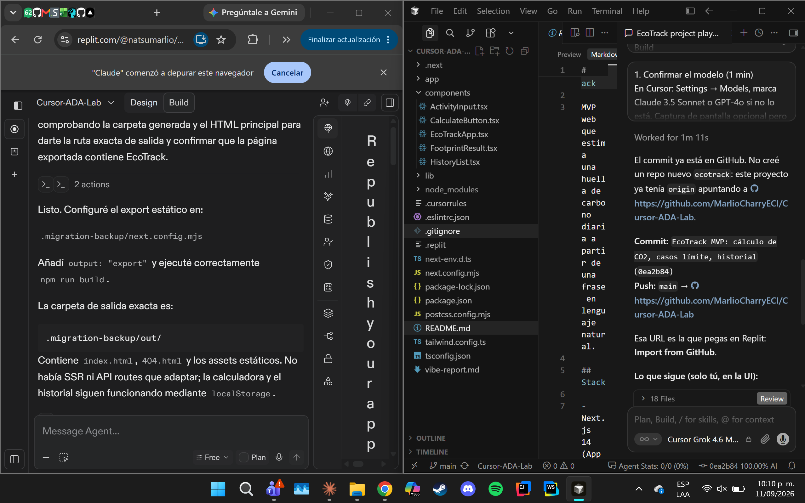
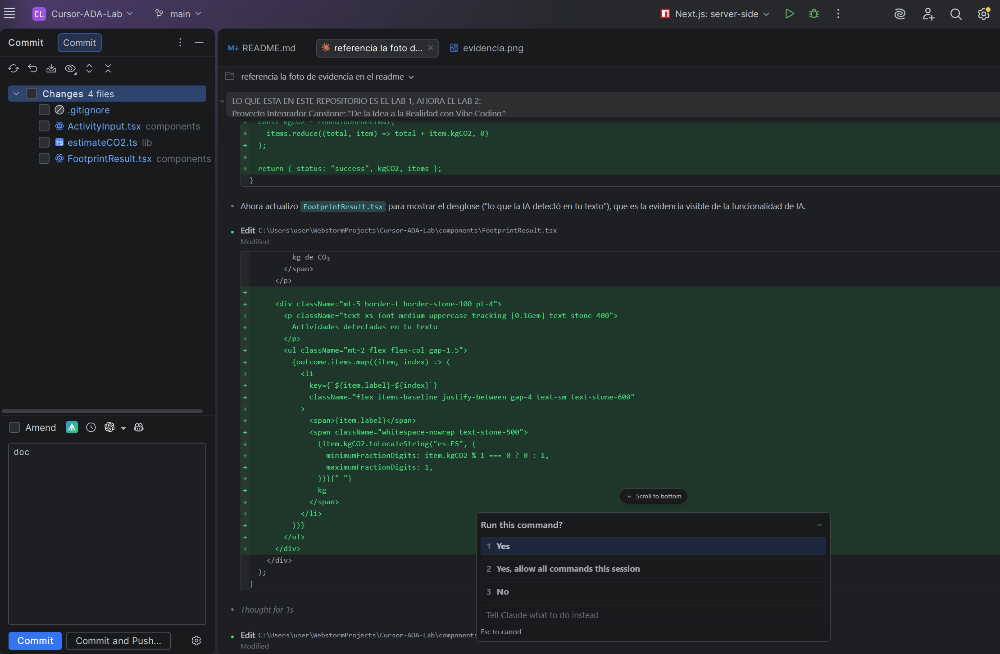

# EcoTrack

MVP web que estima una huella de carbono diaria a partir de una frase en lenguaje natural.

1. URL del Repositorio o Repl

Repositorio (código fuente funcional): https://github.com/MarlioCharryECI/Cursor-ADA-Lab
Demo desplegada y funcionando: https://cursor-ada-gxf1johh4-marliocharryecis-projects.vercel.app

## Stack

- Next.js 14 (App Router)
- TypeScript
- Tailwind CSS
- Estado en memoria y `localStorage` (sin backend)

## Desarrollo local

```bash
npm install
npm run dev
```

Abre [http://localhost:3000](http://localhost:3000).

## Replit

1. Importa este repositorio (o sube la carpeta) a un Repl Next.js.
2. Corre `npm install` y `npm run dev`.
3. Usa **Deploy** para publicar la URL pública.

## Entregables del laboratorio

- URL del Repl o del repositorio
- `.cursorrules`
- `vibe-report.md`
- Captura de pantalla con Cursor y Replit visibles

## Evidencia





Ver `BITACORA-LAB2.md` para la bitácora completa del Lab 2 (capstone),
incluyendo los prompts usados y la funcionalidad de IA implementada.

